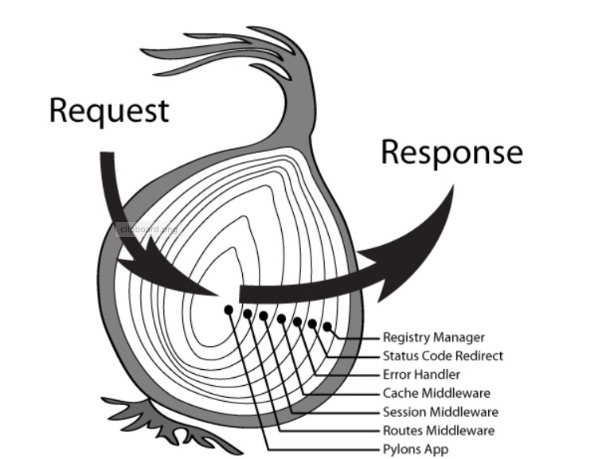

## Koa 中间件 middleWare
app.use(middleWare);    
next 下一个中间件   
每一次use都会注册一个中间件   
[middleWare1,middleWare2]
1. async 函数
2. 洋葱模型：一层一层往最里面执行，最后一个中间件执行完了，一层往外冒泡执行剩余的代码。

3. 解耦：每一个中间件负责一件事   
**以 X 开头的：自定义响应头**

## koa 第三方中间件特点
koa中ctx 就是 req + res 组成的对象    
```
ctx:{
  req:{},
  res:{}
}
```
用了第三方中间件后，比如 koa-views
```
ctx:{
  req:{},
  res:{},
  render:() =>{}
}
```
接着拓展 ctx，接着往ctx上面塞东西，


## 
package.json 项目描述   
依赖 ： npm install 下来的文件。    
-S
```
"dependencies": {
    "ejs": "^2.6.1",
    "koa": "^2.7.0",
    "koa-views": "^6.2.0"
  }
```
npm i 时生成node_modules目录。

## ejs
- <%= %> 原样输出
- <%- %> 解析html
- <% %> 解析js